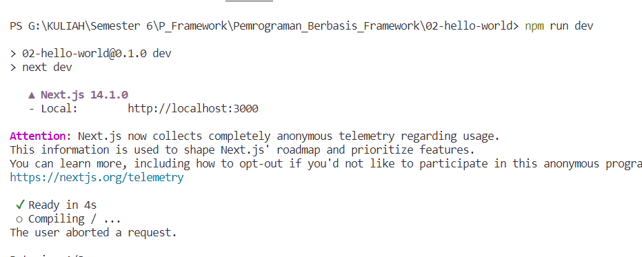

> **FARHAN DWI PRAMANA**
>
> 3C / 04
>
> 2141720125

## Praktikum: Membuat Project Pertama ReactJS

### **Langkah 1: Buat Folder Baru**

Buatlah folder baru bernama belajar-react lalu di dalam folder tersebut, jalankan terminal dengan mengetikkan perintah berikut:

```
npx create-next-app
```

### **Langkah 2: Buat project baru**


### **Soal 1**

- TypeScript -> Bahas pemrograman berbasis JavaScript yang menambahkan fitur strong-typing & konsep pemrograman OOP klasik (class, interface).
- ESLint -> Salah satu linter JavaScript yang digunakan untuk melakukan static analyzes kode agar cepat mengetahui masalah atau potensi bug.
- Tailwind CSS -> Sebuah kerangka kerja (framework) yang didalamanya terdapat sekumpulan utility classes untuk membangun antarmuka kostum dengan cepat.
- App Router -> Mempunyai tanggung jawab untuk menangani perpindahan antara halaman atau rute di dalam aplikasi.
- Import alias -> Digunaan untuk memberikan nama lain atau alias pada modul atau pustaka yang diimpor, atau dengan kata lain memberikan singkatan.

### **Langkah 3: Buka dengan VS Code**

Setelah selesai proses langkah sebelumnya, ketik per baris di terminal seperti berikut untuk masuk ke folder project dan dibuka dengan VS Code.

```
cd hello-world
```

(enter)

```
code .
```

Maka VS Code akan membuka project react Anda yang telah dibuat bernama hello-world.

Perhatikan struktur file dan folder project react yang telah kita buat ini. Terlihat bahwa inisial Git dalam project ini sudah termasuk, sehingga Anda cukup membuat repository di akun GitHub lalu mengonekkan dengan project ini. Silakan cari tau bagaimana setup link repository ke project ini.


### **Soal 2**

1. node_modules -> Digunakan untuk menyimpan dan mengelola dependensi atau paket(libraries).
2. public -> tampat untuk menyimpan berkas statis yang akan diakses langsung oleh client atau browser
3. src -> digunakan untuk menyimpan semua berkas sumber atau kode sumber utama yang dibangun.
4. .eslintrc.json -> berkas konfigurasi untuk ESLint, yang merupakan alat linting untuk JavaScript.
5. .gitignore -> Digunakan untuk mengonfigurasi Git.
6. next.config.mjs -> Digunakan untuk mengkonfigurasi pengaturan khusus (Path, Environtment Variabels).
7. next-env.d.ts -> Berguna untuk mendefinisikan tipe-tipe khusus dan variabel lingkungan di seluruh aplikasi tanpa perlu menentukan ulang tipe-tipe tersebut di berkas-berekas lain.
8. package.json -> Digunakan untuk mendefinisikan informasi tentang aplikasi atau proyek, mendeklarasikan dependensi atau paket-paket yang dibutuhkan, serta menyediakan skrip-skrip yang dapat dijalankan.
9. package-lock.json -> sebuah berkas yang dihasilkan oleh NPM (Node Package Manager) dan digunakan untuk memastikan bahwa proyek Node.js memiliki dependensi yang konsisten di seluruh lingkungan pengembangan dan produksi.
10. postcss.config.js -> Sebuah berkas konfigurasi untuk PostCSS (digunakan untuk melakukan transformasi pada CSS).
11. README.md -> Sebuah berkas teks yang berfungsi sebagai dokumentasi utama atau informasi pengantar untuk suatu proyek.
12. tailwind.config.ts -> sebuah berkas konfigurasi untuk Tailwind CSS(sebuah kerangka kerja CSS utility-first yang memungkinkan Anda mendesain situs web dengan memanfaatkan sejumlah besar kelas utilitas bawaan).
13. tsconfig.json -> Sebuah berkas konfigurasi TypeScript yang digunakan untuk menentukan berbagai opsi dan pengaturan saat mengompilasi kode TypeScript ke JavaScript.

### **Langkah 4: Run**

Sekarang kita coba running project pertama kita dengan menjalankan perintah berikut di terminal VS Code.

```
npm run dev
```

Tunggu proses kompilasi hingga selesai. Lalu Anda dapat membuka alamat localhost di browser: http://localhost:3000/


Jika di browser telah tampil seperti gambar berikut ini, Selamat!


### **Soal 3**

Gantilah teks pada bagian atas dengan Nama - NIM Anda. Contoh seperti gambar berikut:

Jawaban dibuktikan dengan hasil screenshot. <br />

Ketika Anda telah berhasil mengganti teks tersebut, Anda tidak perlu menjalankan perintah npm run dev dan tidak juga diperlukan me-reload halaman di browser. Tiba-tiba perubahan itu tampil, Mengapa terjadi demikian? Jelaskan!
**Terjadi karena didukung dengan fitur hot reload yaitu ketika code diubah maka secara otomatis browser akan merefresh atau me-reload dengan sendirinya selama program masih dijalankan**
