> **FARHAN DWI PRAMANA**
>
> 3C / 04
>
> 2141720125

# REDUX

### Praktikum 1 : Instalasi Redux dan bootstrap

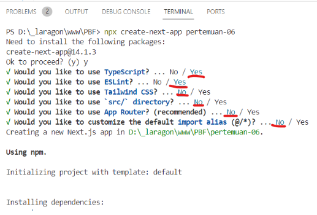

Kita buka open folder untuk project pertemuan-06 di VS Code, maka isi direktori yang ada di dalamnya sedikit berbeda dengan project yang sudah pernah kita buat sebelumnya. Yaitu terdapat folder pages dan styles.

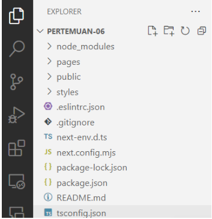

Kali ini kita coba pakai CSS Library Bootstrap dengan menjalankan perintah

```
npm install bootstrap
```

Kemudian kita import bootstrap pada aplikasi next.js kita. Kita edit file pages/\_app.tsx

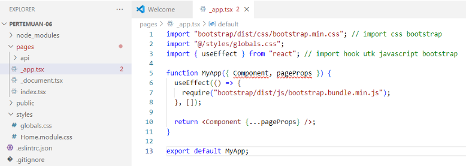

Sekarang kita perlu mencoba implementasi bootstrap pada project next.js kita.

Contoh kita edit file pages/index.tsx menjadi seperti ini

```
export default function Home() {
  return (
    <div className="container">
      <div className="row">
        <div className="col-12">
          <button type="button"
                  className="btn btn-primary"
                  data-bs-toggle="modal"
                  data-bs-target="#exampleModal">
                  Coba Model Bootstrap
          </button>
        </div>
      </div>
      <div  className="modal fade"
            id="exampleModal"
            tabIndex="-1"
            aria-labelledby="exampleModalLabel"
            aria-hidden="true">
        <div className="modal-dialog">
          <div className="modal-content">
            <div className="modal-header">
              <h5 className="modal-title text-black" id="exampleModalLabel"> yay... </h5>
              <button
                type="button"
                className="btn-close"
                data-bs-dismiss="modal"
                aria-label="Close"></button>
            </div>
            <div className="modal-body text-black">
              <h2>Halo semua, kita sedang menggunakan bootstrap di Next.js</h2>
            </div>
          </div>
        </div>
      </div>
    </div>
  );
}
```

#### Hasil

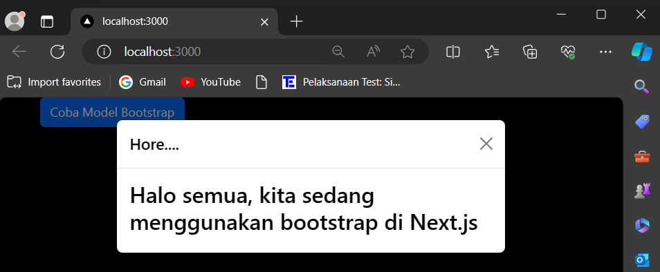

### Praktikum 2 : Contoh Login dengan Redux

Komponen yang digunakan pada praktikum kali ini adalah redux-toolkit dan redux-persistent sehingga kita perlu menginstall-nya

```
npm i --save redux-persist react-redux @reduxjs/toolkit
```

Selanjutnya kita install wrapper untuk redux di next.js

```
npm i --save next-redux-wrapper
```

Selain itu, kita akan menggunakan html parser yang ada di react. Hal ini kita gunakan untuk memparsing html string menjadi sebuah html page

```
npm install html-react-parser
```

Setelah berhasil menginstal kita cek di file package.json apakah library sudah ada

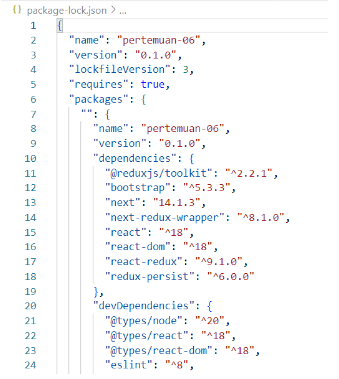

Selanjutnya, kita buat folder dengan nama redux yang sejajar dengan folder public

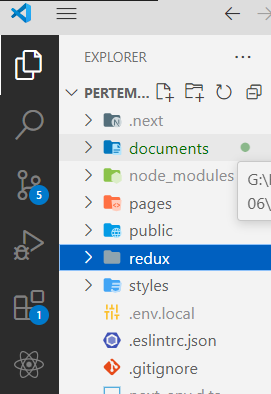

Kemudian kita buat file redux/auth/authSlice.js seperti berikut

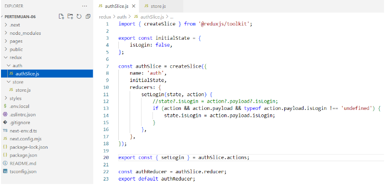

Selanjutnya kita buat file redux/store/store.js seperti berikut

```
import { combineReducers, configureStore } from '@reduxjs/toolkit';
import authReducer from '../auth/authSlice';
import storage from 'redux-persist/lib/storage';
import { persistStore, persistReducer, FLUSH, REHYDRATE, PAUSE, PERSIST, PURGE, REGISTER } from 'redux-persist';

const persistConfig = {
   key: process.env.NEXT_PUBLIC_FINGERPRINT_NAME,   // simpan config di file .env.local
   storage,
   whitelist: ['auth'],
};

const rootReducer = combineReducers({
   auth: authReducer,
});

const persistedReducer = persistReducer(persistConfig, rootReducer);
const store = configureStore({
   reducer: persistedReducer,
   middleware: (getDefaultMiddleware) =>
      getDefaultMiddleware({
         serializableCheck: {
            ignoredActions: [FLUSH, REHYDRATE, PAUSE, PERSIST, PURGE, REGISTER],
         },
      }),
});

const persistor = persistStore(store);
export { store, persistor };
```

Key pada persistConfig kita simpan pada file .env.local dengan tujuan agar konfigurasi lebih mudah dan aman. Sehingga jika belum ada file .env.local, kita buat dahulu

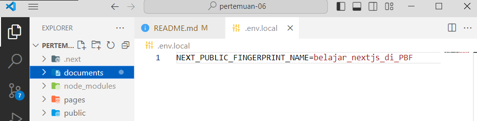

Selanjutnya, kita buat file baru di pages/login.tsx, dan kita tulis kode berikut

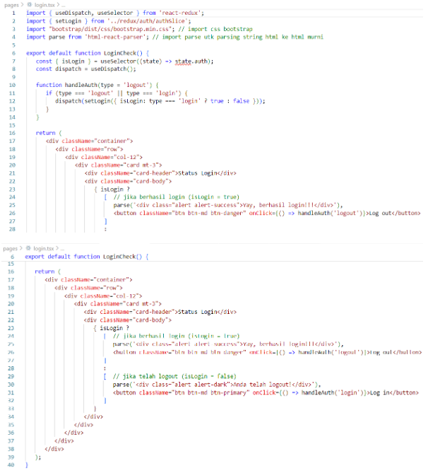

#### Hasil

Soal 1
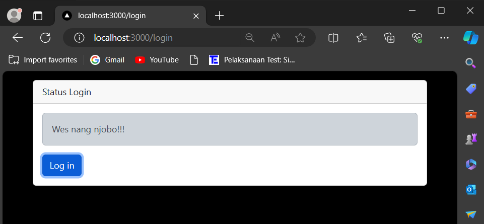

Soal 2

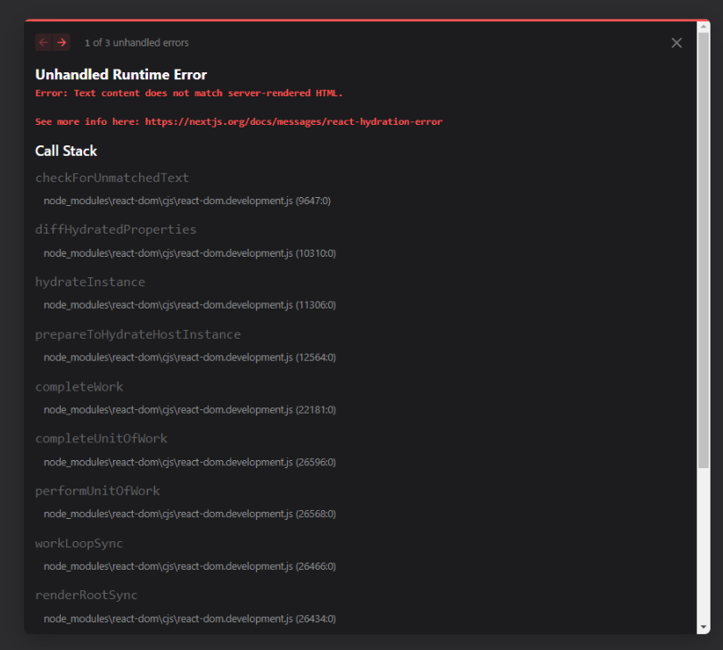

Akan terjadi error dikarenakan react tidak bisa secara langsung atau otomatis mengkonversi string HTML menjadi sebuah elemen react.

### Praktikum 3 : Membuat Aplikasi Counter Sederhana

Kita buat file di redux/counter/naikTurunSlice.js

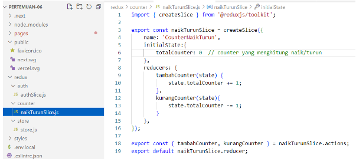

Setelah itu kita modifikasi redux/store/store.js untuk menambahkan Redux reducer pada store

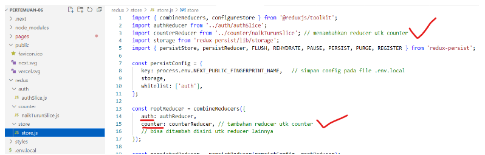

Selanjutnya kita buat halaman untuk menampilkan counter.

Kita buat file baru di pages/counter.tsx

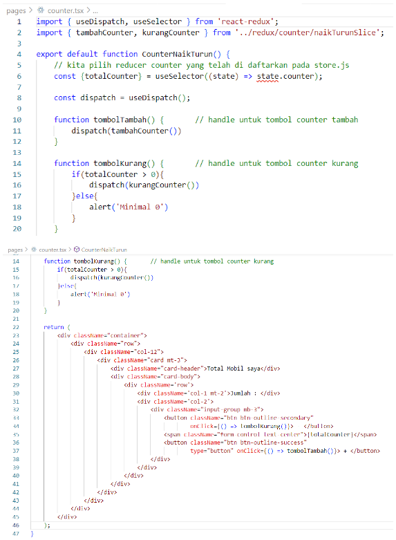

#### Hasil

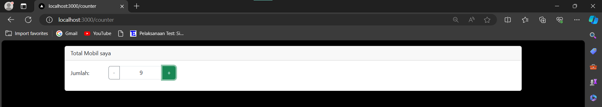

#### TUGAS (PERTANYAN PRAKTIKUM)

Berdasarkan pada praktikum sebelumnya yang telah dilakukan, beberapa pertanyaan terkait praktikum perlu diselesaikan yaitu sebagai berikut.

1. Apa kegunaan dari kode ini import { useEffect } from "react"; Pada file pages/\_app.tsx? jelaskan
2. Jika pada file pages/\_app.tsx kita tidak menggunakan useEffect (menghapus baris 3, dan baris 9-11, apa yang akan terjadi?
3. Mengapa di react/nextjs penulisan tag html untuk class, harus diganti menjadi className ?
4. Apakah store pada nextjs bisa menyimpan banyak redux reducer?
5. Jelaskan kegunaan dari file store.js!
6. Pada file pages/login.tsx, apa maksud dari kode ini ?
   const { isLogin } = useSelector((state) => state.auth);
7. Pada file pages/counter.tsx, apa maksud dari kode ini?
   const {totalCounter} = useSelector((state) => state.counter);
