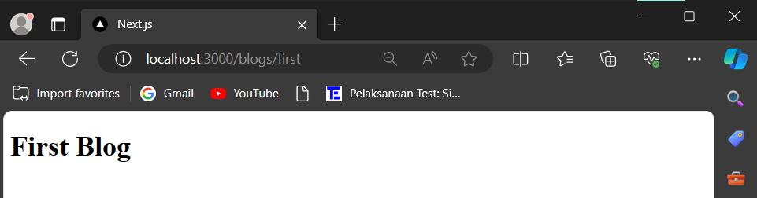
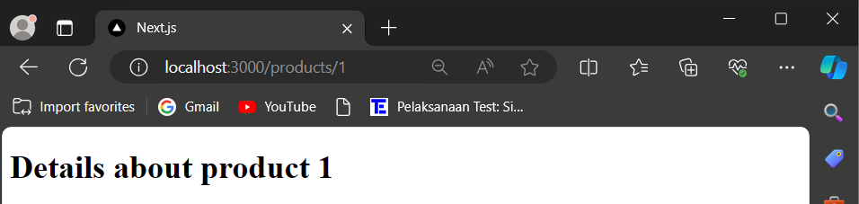

> **FARHAN DWI PRAMANA**
>
> 3C / 04
>
> 2141720125

# ROUTING

### Praktikum 1: Membuat routing sederhana

1. Persiapkan project dengan memanfaatkan template repository yang telah dipersiapkan di alamat https://github.com/dhanifudin/routing-demo dan gunakan tombol Use this template kemudian pilih Create a new repository.

2. Clone project ke lokal laptop anda dan lakukan instalasi dependencies dengan menjalankan perintah berikut.

```
npm install
```

3. Silahkan buka project tersebut dengan menggunakan VSCode dan perhatikan file yang ada dalam folder app.

4. Routing di ReactJS dengan NextJS memanfaatkan
   organisasi penamaan folder dan file pada folder app. Silahkan tambahkan file page.tsx di dalam folder app, dan buatlah komponen dengan kode berikut.

```
export default function Home() {
  return <h1>Welcome to Home</h1> ;
}
```

5. Jalankan project dengan menggunakan perintah npm run dev di terminal VSCode. Dan silahkan buka browser pada alamat url http://localhost:3000

6. Perhatikan pada project di VSCode, akan terdapat sebuah file yang akan digenerate yaitu layout.tsx. File ini akan secara otomatis digenerate jika tidak ditemukan. Perhatikan susunan kode yang ada didalamnya. Anda akan menemukan susunan html yang di dalamnya terdapat props children. Props children akan di-replace oleh komponen sesuai dengan routing.

7. Untuk membuat halaman routing /about dengan NextJS, silahkan buat folder /about dalam /app dan buat file dengan nama page.tsx. Kemudian buat function komponen seperti pada kode berikut.

8. Lakukan commit ke project setelah menyelesaikan semua Praktikum 1. Jangan lupa untuk mendokumentasikan dengan tangkapan layar dan menyimpan di folder /images di project anda.

```
export default function About() {
  return <h1>Welcome to About</h1> ;
}

```

#### Hasil Praktikum 1

1. About
   

2. Home
   

3. Profile
   

### Praktikum 2: Membuat routing bersarang (Nested Routing)

1. Dengan menggunakan konsep yang sama pada Praktikum 1, silahkan tambahkan susunan folder /blogs/first dan /blogs/second. Kemudian tambahkan masing-masing untuk setiap folder dengan file page.tsx.

2. Pada file /blogs/page.tsx buatlah function component seperti kode berikut atau anda dapat mengkreasikan tampilan dengan selera anda!

```
export default function Blog() {
  return (
        <h1>Blog</h1>
  );
}
```

3. Pada file /blogs/first/page.tsx buatlah function component seperti berikut:

```
export default function FirstBlog() {
  return (
        <h1>First Blog</h1>
  );
}
```

#### Hasil Praktikum 2

1. Blog
   

2. First Blog
   

3. Second Blog
   

### Praktikum 3: Membuat routing dinamis (Dynamic Routing)

1. Buatlah file /products/page.tsx yang berisi function component untuk menampilkan list dari products seperti kode berikut.

```
export default function ProductList() {
  return (
        <div>
          <h1>Product List</h1>
          <h2>Product 1</h2>
          <h2>Product 2</h2>
          <h2>Product 3</h2>
        </div>
  );
}
```

2. Untuk mendefinisikan url path di NextJs menggunakan konvensi penamaan direktori dengan mengapit nama path dengan simbol [ ]. Sebagai contoh: [productId] menandakan bahwa path dinamis menggunakan variabel productId (Catatan: Anda boleh menuliskan hanya dengan [id], tetapi untuk mempermudah pembacaan konteks sebaiknya jangan gunakan hanya id).

3. Kemudian buatlah file page.tsx pada lokasi /app/products/[productId] dan tambahkan kode sebagai berikut.

```
type Props = {
  params: {
        productId: string
  }
}

export default function ProductDetails({ params }: Props) {
  return (
        <h1>Details about product {params.productId}</h1>
  )
}
```

4. Untuk mendapatkan nilai path, anda dapat menggunakan pemanggilan params.productId. Pemanggilan atribut params, disesuaikan dengan pendefinisian nama path.

5. Cobalah akses halaman /products dan /products/1 pada browser anda. Ubah nilai productId dengan nilai lainnya.

#### Hasil Praktikum 3

1. Product
   

2. Product / Product Id
   

3. Review
   

### Praktikum 4: Navigasi dengan Link Component

1. Pada file /app/page.tsx tambahkan import Link komponen seperti kode berikut.

```
import Link from "next/link";
```

2. Tambahkan penggunaan Link komponen untuk mengakses halaman /profile dan /about

```
export default function Home() {
  return (
        <div>
          <h1>Welcome to Home</h1>
          <Link href='/profile'>Profile</Link>
          <Link href='/about'>About</Link>
        </div>
  );
}
```

#### Hasil


